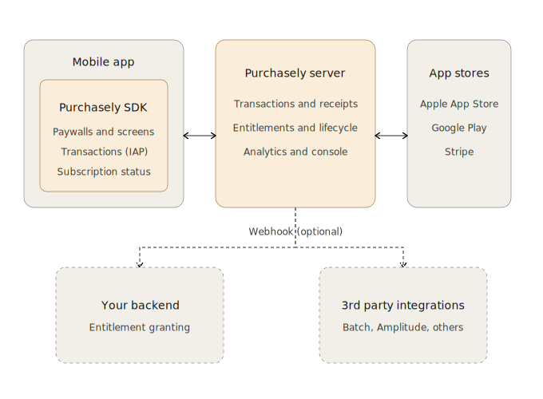
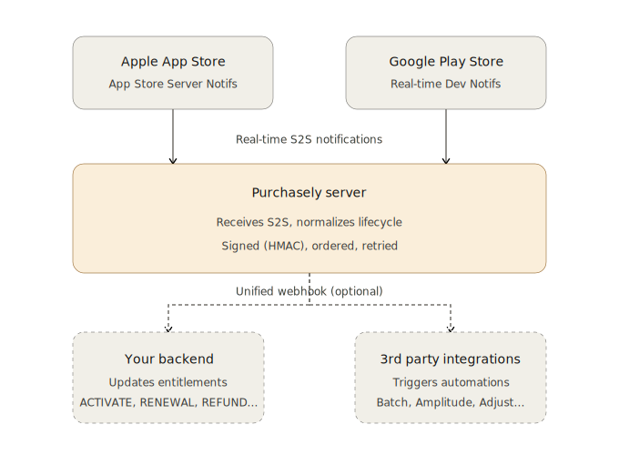

# Purchasely — End-to-End Architecture

This document explains how the Purchasely platform is wired end-to-end: the on-device SDK, the Purchasely Server, the stores, your backend, and your third-party tools (CRM, analytics, attribution).

It is the canonical reference to understand **where each component sits**, **what flows between them**, and **what the resilience guarantees are** — read this before diving into integration, review, debugging, or answering architecture questions.

---

## 1. Platform Overview

### Application side

The Purchasely SDK is integrated natively into your iOS / Android app. It:

- Renders paywalls natively (UIKit / SwiftUI on iOS, Android Views / Jetpack Compose on Android) — no webview.
- Triggers in-app purchases through the native store APIs (StoreKit 2 on iOS, Google Play Billing on Android).
- Exposes the user's subscription status to your code.
- Emits SDK and UI events your app can react to (paywall displayed, purchase started, purchase succeeded, plan selected, etc.).

### Server side

The **Purchasely Server** orchestrates the entire subscription back-office:

- Receipt validation against the store server APIs (Apple App Store Server API, Google Play Developer API, Huawei, Amazon).
- Entitlement management.
- Lifecycle normalization (translates heterogeneous Apple/Google formats into a unified event schema).
- The no-code console (paywall design, audiences, A/B tests, analytics).

### Two external integration points

Two systems consume the same lifecycle stream:

1. **Your backend** receives lifecycle events via **webhook (Server-to-Server)** so it can persist entitlements and drive your business logic.
2. **Your third-party tools** (Batch, Amplitude, Adjust, Braze, Segment, …) receive the same events to drive CRM, analytics, and attribution automations.

> Purchasely can run **without** these two components — it can manage entitlements on its own. For a publisher with a multi-channel subscriber back-office (web + mobile + TV), the webhook to your backend is generally the central integration point.

---

## 2. Purchase Flow in Full Mode

In **Full mode**, Purchasely owns the purchase flow end-to-end. Here is what happens, step by step.

### Step 1 — SDK initialization

On app launch, the SDK is initialized with `Purchasely.start()` (or platform equivalent), passing your API key and the user's `userId`. It pulls the configuration (paywalls, audiences, active experiments) from the Purchasely Server.

### Step 2 — Paywall display

The app calls `Purchasely.display("placement_id")` (or fetches a presentation and displays it). The SDK renders the paywall natively — no webview.

### Step 3 — User action

The user taps an offer. The SDK triggers the native IAP flow via **StoreKit 2** (iOS) or **Google Play Billing** (Android). This communication is **local**, between the SDK and the store, on the device.

### Step 4 — Store payment

Apple or Google authenticates the user, processes the payment, and returns the **receipt** to the SDK.

### Step 5 — Server validation

The SDK forwards the receipt to the Purchasely Server. The server validates it directly with the store's server API (App Store Server API / Google Play Developer API), persists the transaction, and acknowledges it back to the store.

### Step 6 — Webhook fan-out (optional, in parallel)

The Purchasely Server emits an `ACTIVATE` event to:

- **Your backend** — persists the entitlement for that `userId`.
- **Your third-party integrations** active in the console — relays the same event for CRM / analytics / attribution.

### Step 7 — Confirmation

The Purchasely Server confirms success to the SDK, which notifies the app. The app refreshes its subscription status (from your backend or directly via the SDK) and unlocks premium content.

---

## 3. Resilience and Delivery Guarantees

Server validation (step 5) **only depends on Apple / Google**. Your backend is **never on the critical path** of the transaction — it is notified in parallel.

Concretely:

- A backend outage on your side **does not block** the purchase or the paywall rendering.
- If your webhook endpoint does not respond `HTTP 200` within 10 seconds, the Purchasely Server **automatically retries** with exponential backoff for up to **21 days**. You lose **no events**, even during a prolonged incident on your infrastructure.
- Each payload is **HMAC-SHA256 signed**.
- **Per-user event order is guaranteed**: a `RENEWAL` can never arrive before its corresponding `ACTIVATE`.

---

## 4. Subscription Lifecycle After Purchase

Once the subscription is active, the lifecycle continues **server-side**, with no app intervention. Apple and Google notify Purchasely in real time on every event:

- Renewal
- Cancellation
- Refund
- Grace period
- Billing retry / payment failure
- Subscription transfer
- Upgrade / downgrade / crossgrade

These notifications use the official store channels:

- **Apple** — App Store Server Notifications **v2**.
- **Google** — Real-time Developer Notifications (Pub/Sub).

The Purchasely Server **normalizes these heterogeneous formats** into a unified event schema, then **fans them out** via webhook to:

- **Your backend** — updates entitlements for the user.
- **Your CRM / analytics / attribution tools** — trigger their automations (grace-period reminder, post-churn win-back, post-renewal loyalty message, …).

---

## 5. When to Reference This Document

| You are doing… | This doc gives you… |
|----------------|---------------------|
| **Integrating** the SDK | The big picture: what runs on device, what runs server-side, where webhooks fit. |
| **Reviewing** an integration | Understanding of resilience guarantees so you can spot anti-patterns (e.g., putting your backend on the critical purchase path). |
| **Debugging** a missing event | The lifecycle map: where the event comes from (Apple / Google), how it transits (Purchasely Server), where it lands (webhook + 3rd-party fan-out). |
| **Answering** a customer question | The vocabulary and diagrams to explain Full mode, S2S webhooks, and the role of each component. |

---

## 6. See Also

- `architecture-patterns.md` — recommended **client-side** architecture patterns (`PurchaselyWrapper`, Observer mode reactive flow, MVVM, prefetch, embedded paywalls, testability).
- `ios/`, `android/`, `react-native/`, `flutter/`, `cordova/` — platform-specific API references and integration guides.
- `troubleshooting/common-issues.md` — known issues and fixes.
